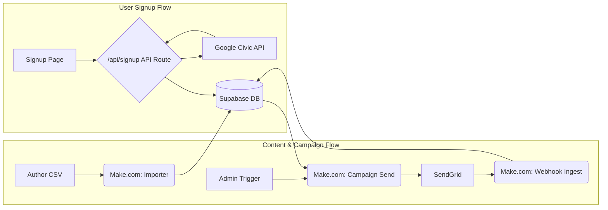

# YFF V2.1 — Overall Plan (Simple, Testable, Split)

**North Star:** Keep each piece tiny and independently deployable. Everything meets in **Supabase**. No runtime external lookups during sends.

---

## Architecture



**Responsibilities**
- **Signup App & API Route:** Captures email+address, validates, calls Google Civic API for enrichment, and upserts the profile to Supabase.
- **Content Importer (Make.com):** Validates CSV slices and upserts `content_slices`.
- **Send Engine (Make.com):** Queries `profiles`, assembles single article from slices, sends, and logs.
- **Edge Functions (Optional/Other):** Used for auxiliary tasks like unsubscribe handling, not for signup enrichment.

---

## Interfaces (contracts)

- **Frontend → API Route (/api/signup):**
```json
{ "email":"a@b.com", "address":"123 Main, Upper Arlington, OH 43221", "recaptchaToken":"..." }
```
- **API Route → Google Civic API:**
```
GET /civicinfo/v2/divisionsByAddress?address=123+Main+St,+Upper+Arlington,+OH+43221&key=API_KEY
```
- **API Route → Supabase (direct upsert):**
```json
{ "email":"a@b.com", "address":"123 Main St, Upper Arlington, OH 43221", "zipcode":"43221",
  "ocd_ids":["ocd-division/country:us",".../state:oh",".../place:upper_arlington"],
  "ocd_last_verified_at":"2025-09-19T18:14:44.199Z"
}
```
- **Admin → Send scenario:**
```json
{ "campaign_tag":"funding-2025-08", "article_key":"funding-2025-08",
  "audience_filter":{"state":"OH"}, "send_batch_id":"<uuid>" }
```

---

## Milestones

1) **M1 – Signup working**
   - Next.js page live on Vercel.
   - Make divisionsByAddress writes `ocd_ids` to Supabase.
   - Basic privacy text added.

2) **M2 – Importer working**
   - Author CSV validated and imported to `content_slices`.
   - Sample article exists (funding example).

3) **M3 – Send working (test mode)**
   - Assemble and send to 1–2 test emails.
   - `delivery_history` & webhook `delivery_events` populate.

4) **M4 – Pilot**
   - 10–50 recipients. Confirm unsubscribe & suppression behavior.
   - Add simple admin trigger UI (optional).

---

## Test strategy (always-on)

- **Unit**: renderer unhappy paths; CSV validation rules.
- **Contract**: payload schemas between Next.js ↔ Make ↔ Supabase.
- **E2E**: address→ocd_ids saved; send→events ingested; idempotency respected.

---

## Ops Runbook (short)

- Before a send: generate new `send_batch_id`, do a test to yourself, verify logs.
- After a send: scan `delivery_events` for bounces/complaints; suppress as needed.
- Weekly: refresh any `profiles` where `ocd_last_verified_at` > 6 months.

---

## De-risking choices

- **Supabase is source of truth** for `ocd_ids` → no live lookups.
- **One-article assembly** → minimal template complexity; easy previews.
- **Idempotent keys** (`send_batch_id`, importer composite key) → safe retries.
- **Keep scopes canonical** (`scope_ocd_id` is the OCD key) → simple matching.

---

## Implementation Details

### Standard Error Contract (Every Endpoint/Webhook)

```json
// Success
{ "ok": true, "data": { /* ... */ } }

// Failure
{ "ok": false, "code": "VALIDATION_ERROR", "message": "Bad address", "details": { "field": "address" } }
```

### Idempotency Rules

- **Importer**: Unique constraint `(article_key, section_order, scope_ocd_id, sort_index)`; upsert on conflict
- **Send**: `send_batch_id` required; skip if `(email, campaign_tag, send_batch_id)` already logged
- **Signup**: Upsert profiles on email; create/ensure unique `(user_id, list_key)` in subscriptions

### Rate Limiting (MVP)

- **Signup**: Turnstile/reCAPTCHA + throttle by email+IP (≤3 attempts/10 minutes)
- Implement in Make (router) or Next.js API route; reject with 429 using standard error format

### Monitoring & Health

- **Next.js**: `/api/health` returns `{ ok: true }`
- **Make**: "Heartbeat" scenario runs hourly and writes a `health_pings` row
- **Alerting**: Consecutive failures > 3 in Make; any 5xx from Edge functions

---

## Database Schema & Security

### RLS Policies

#### Profiles Table
```sql
alter table profiles enable row level security;

-- Only authenticated owner can read/update (if exposed from client)
create policy "profiles_owner_read"
  on profiles for select
  using (auth.uid() = user_id);

create policy "profiles_owner_update"
  on profiles for update
  using (auth.uid() = user_id);

-- Inserts/reads by service roles (Edge/Make) bypass RLS via service key
create unique index if not exists idx_profiles_email_unique on profiles (email);
```

#### Subscriptions Table
```sql
alter table subscriptions enable row level security;

create policy "subscriptions_owner_read"
  on subscriptions for select
  using (auth.uid() = user_id);

create policy "subscriptions_owner_upsert"
  on subscriptions for insert with check (auth.uid() = user_id)
  to authenticated;

create unique index if not exists idx_subscriptions_unique on subscriptions (user_id, list_key);
```

#### Content & Delivery Tables (Service-Only Access)
```sql
-- Content slices
alter table content_slices enable row level security;
create policy "content_service_only"
  on content_slices for all
  using (false);

-- Delivery tables
alter table delivery_history enable row level security;
alter table delivery_events enable row level security;
create policy "delivery_service_only_history" on delivery_history for all using (false);
create policy "delivery_service_only_events" on delivery_events for all using (false);

-- Service role (Edge/Make) can still read/write via key; no public access
```

### Idempotent Keys & Indexes

```sql
-- Content deduplication
create unique index if not exists idx_content_key
  on content_slices (article_key, section_order, coalesce(scope_ocd_id,''), sort_index);

-- Delivery deduplication
create unique index if not exists idx_delivery_dedupe
  on delivery_history (email, campaign_tag, send_batch_id);
```

---

## Unsubscribe & Privacy Management

### Unsubscribe Contract

**Link Format**: `/unsubscribe?token=<signed>`

**Token Generation**: HMAC-SHA256 over `{ email, list_key }` with server secret

**Edge Function**: Accepts `{ token }`, validates, and sets `subscriptions.unsubscribed_at = now()` if not already set

**Response**: Returns `{ ok: true }`

**Idempotency**: Second call returns `{ ok: true }` as well

### Privacy, Retention & Backups

#### PII Minimization
- **Do not store**: Phone numbers
- **Address handling**: Keep full address only if necessary; otherwise use city/state/zip from `normalizedInput`

#### Data Retention
- **Address redaction**: After 12 months of inactivity
- **OCD IDs**: Keep indefinitely (not PII - jurisdiction identifiers only)

#### User Rights
- **Right to delete**: `DELETE /profile` edge function that hard-deletes profiles + subscriptions

#### Backup Strategy
- **Point-in-time recovery**: Enable Supabase PITR
- **Weekly exports**: `profiles (email, ocd_ids*, created_at)` to secure bucket
- **Legal compliance**: Link from `/privacy-policy`

> **Note**: `ocd_ids` are not PII; they're jurisdiction identifiers.

---

## Go/No-Go Decision

**✅ GO** - Plan is now production-ready with comprehensive security, error handling, and monitoring. The remaining risks (privacy compliance, data retention) are operational concerns that can be addressed during implementation without blocking architecture decisions.
